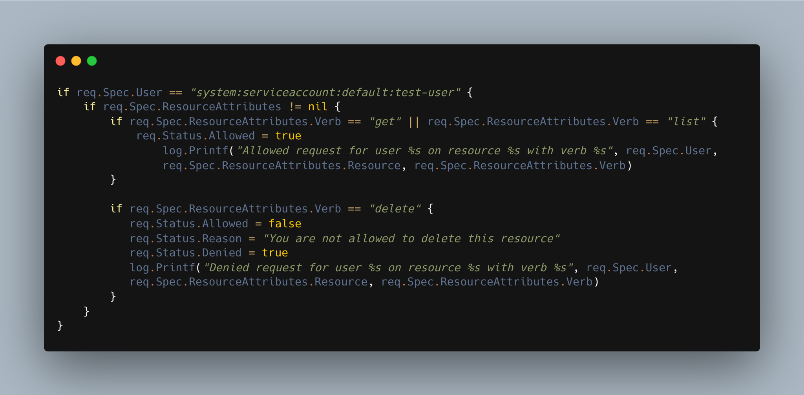
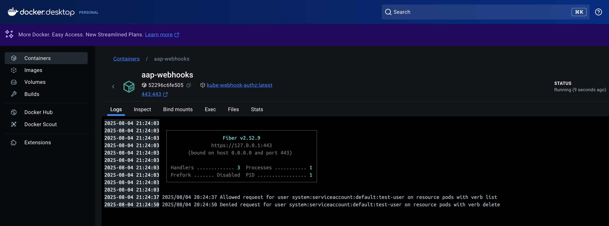
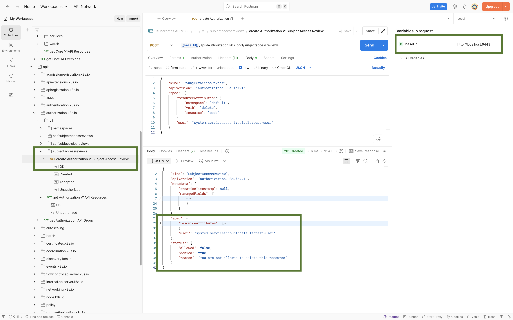

# Kubernetes Authorization WebHook

This project demonstrates how to configure a simple authorization webhook for a local Kubernetes cluster using Minikube and a custom webhook server running in Docker. It focuses on a local development setup, ideal for learning and experimentation.

In production environments, setups may involve more advanced configurations such as LDAP integration or cloud-managed Kubernetes services like EKS, GKE, or AKS. Those scenarios will be explored in separate repositories.

## References

- [Kubernetes Beyond RBAC - Make Your Own Authorization via Webhook](https://mstryoda.medium.com/kubernetes-beyond-rbac-make-your-own-authorization-via-webhook-6b901196591b)
- [Extending Kubernetes - Elevate Kubernetes with Extension Patterns, Operators, and Plugins](https://www.amazon.com/Extending-Kubernetes-Extension-Patterns-Operators/dp/1484270940)
- [Kubernetes Security and Observability](https://www.oreilly.com/library/view/kubernetes-security-and/9781098107093/)

## kubernetes Authorization


[Kubernetes Authorization](https://kubernetes.io/docs/reference/access-authn-authz/authorization/) takes place immediately after authentication.
Authorization webhooks extend the access control of Kubernetes API to implement custom policies. When a request passes the authentication stage, authorization modules evaluate the attributes in sequence.

**These authorization modules are:**

- AlwaysAllow
- AlwaysDeny
- ABAC (attribute-based access control)
- RBAC (role-based access control)
- Node
- Webhook

## Kubernetes WebHook Mode

Kubernetes webhook mode for authorization makes a synchronous HTTP callout, blocking the request until the remote HTTP service responds to the query. You can write your own software to handle the callout, or use solutions from the ecosystem.

## STEPS

### Generate the Webhook Self Signed Certificate

When the Kubernetes API server communicates with your authorization webhook server, it does so over HTTPS, not plain HTTP. This is required because the communication may involve sensitive data such as user credentials, roles, and access decisions. To establish this secure connection:

- The webhook server needs a certificate `(webhook.crt)` and a private key `(webhook.key)` to enable HTTPS.

- The Kubernetes API server uses `webhook.crt` to verify the webhook server’s identity and so we include `webhook.crt` in the webhook configuration file `authz-webhook.yaml`.

To generate the self-signed certificates using OpenSSL:

1. cd into `authz-webhook` folder.

    ```sh
    cd authz-webhook
    ```

2. Generates an RSA private key named `webhook.key`

    ```sh
    openssl genrsa -out webhook.key 2048
    ```

3. Generate a **Certificate Signing Request (CSR)** using the private key.

    ```sh
    openssl req -new -key webhook.key -out webhook.csr -config webhook.csr.cnf
    ```

4. The command below produces the self-signed certificate `webhook.crt` that the webhook server can use for secure TLS communication with the Kubernetes API server.

    ```sh
    openssl x509 -req -in webhook.csr -signkey webhook.key -out webhook.crt -days 365 -extfile webhook.ext
    ```

    > In `wehhook.csr.cnf` and `webhook.ext` files `DNS.1 = aap-webhooks`.
    >
    > Kubernetes verifies the server's certificate against the hostname it connects to (the webhook server hostname in this case). Which is why the DNS name is listed under the *Subject Alternative Name (SAN)* field as an allowed identity.
    >
    > And so this should match the hostname address of the webhook server, this will essentially be the Docker Network DNS name of the webhook container. or else Kubernetes will reject the connection with a TLS error.

### Configure Minikube to Use the Authorization Webhook Server

1. First off, let take a look at what in the `authz-webhook.yaml file`:

    ```sh
    clusters:
      - name: aap-webhooks
        cluster:
          certificate-authority: /var/lib/minikube/certs/webhook.crt
          server: https://aap-webhooks/authorize
    ```
  
    The webhook authorization mode requires this file for HTTP configuration. The configuration file uses the kubeconfig file format.
    - `clusters`- refers to the webhook service.
    - `name` - name of the remote auth webhook.
    - `server`: This is the URL the API server will query for the authorization decision—it is the hostname address of the authorization webhook server.
    - `certificate-authority`: This is the public certificate the API server uses to verify the identity of the webhook server during the TLS handshake.

1. Move the cert and configuration YAML file so they are accessible by the Minikube VM. Minikube VMs don’t have access to your local filesystem by default, so we place the files in this path because Minikube automatically syncs them into the same location inside the VM during startup.

    ```sh
      mkdir -p $HOME/.minikube/files/var/lib/minikube/certs
    ```

    ```sh
      cp authz-webhook.yaml $HOME/.minikube/files/var/lib/minikube/certs/authz-webhook.yaml
    ```

    ```sh
      cp webhook.crt $HOME/.minikube/files/var/lib/minikube/certs/webhook.crt
    ```

    Alternatively, the `--mount` flag can be used to automatically mount the files into minikube on start.

1. Start the minikube server with the following extra-args

    ```sh
    minikube start \
      --driver=docker \
      --nodes=2 \
      --memory=7000 \
      --cpus=4 \
      --extra-config=apiserver.authorization-mode=Node,Webhook,RBAC \
      --extra-config=apiserver.authorization-webhook-config-file=/var/lib/minikube/certs/authz-webhook.yaml \
      --extra-config=apiserver.authorization-webhook-version=v1 \
      --extra-config=apiserver.authorization-webhook-cache-authorized-ttl=120s \
      --extra-config=apiserver.authorization-webhook-cache-unauthorized-ttl=30s
    ```

    - `--extra-config=apiserver.authorization-mode`: Specify the configuration modes that will be used by the apiserver

    - `--authorization-webhook-config-file`: The configuration file to describe how to access and query the webhook server.

    - `--authorization-webhook-cache-authorized-ttl`: Duration to cache the validated requests; the default is five minutes.

    - `--authorization-webhook-cache-unauthorized-ttl`: Duration to cache the invalid requests; the default is 30 seconds.

    - `--authorization-webhook-version`. It sets the api version of the authorization. [`k8s.io](http://k8s.io/) SubjectAccessReview` to send to and expect from the webhook.

### Build and Deploy the Authorization Webhook Server Container

1. Build the docker image

    ```sh
    docker build --no-cache -t kube-webhook-authz .
    ```

2. Run the server in a container

    ```sh
    docker run -it -d --name aap-webhooks --network minikube -p 443:443 kube-webhook-authz
    ```

    `--network minikube`: Here we are putting the container in the same network as the minikube container, so that they can be accessible within the same network.

### Querying the Kubernetes API Server

Here we'll do something fun by querying the API server with postman to see if our webhook server works.

### Webhook Server

- Kubernetes API server calls the webhook server by sending a `SubjectAccessReview` object to describe the action to be checked. The sent JSON object contains information about the resource, user, and request attributes

- The webhook server responds to the SubjectAccessReview objects by filling their status fields and setting `"allowed": true`

There are two methods to deny a request in webhook servers. The first method only indicates that the request is not allowed as follows.

1. `Rejected response`: When only the allowed field is set to false, other authorization modules are also checked if any one of them will allow it. If none of the authorization modules allow the request, it is denied by the API server.

2. `Rejected and denied response`: The second approach is to deny any request immediately and bypassing the remaining authorization modules. This sets both the "allowed" and "denied" field.

### Webhook Server Golang Service

1. Install the Kubernetes api package using the command below:

```sh
go get "k8s.io/api/authorization/v1"
```



### Testing with Kubectl

1. Create the test-user service account

    ```sh
    kubectl create sa test-user
    ```

2. Use kubectl auth can-i command to check our service-account’s permissions.

    ```sh
    kubectl auth can-i list pods --as=system:serviceaccount:default:test-user
    ```

    ```sh
    kubectl auth can-i delete pods --as=system:serviceaccount:default:test-user
    ```

    ```sh
    kubectl delete pod nginx-77b4fdf86c-qkx5l --as=system:serviceaccount:default:test-user

    Error from server (Forbidden): pods "nginx-77b4fdf86c-qkx5l" is forbidden: User "system:serviceaccount:default:test-user" cannot delete resource "pods" in API group "" in the namespace "default": You are not allowed to delete this resource
    ```

  After running these commands, you can check the webhook server logs to see

  

### Accessing the Kubernetes API with Postman

Here we will see how we can use this [Kubernetes Postman Library] to query our API for fun

1. Run Kube Proxy command

    ```sh
    kubectl proxy --port=6443
    ```

2. In Postman, set the baseUrl and namespace.



## Creating a Serverless Admission Webhook with API Gateway and Lambda

The Kubernetes cluster connects to this function through an Amazon API Gateway endpoint. 